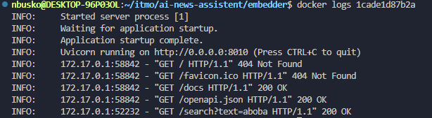
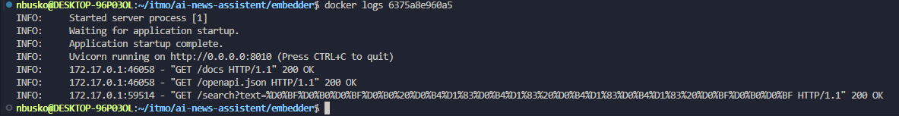

# Лабораторная работа 1

## Проект – Сервис для генерации текстовых эмбеддингов

### Антипаттерны в Dockerfile и их исправление:

#### 1. Использование последней версии образа Python
**Проблема:** Применение последней версии (latest) образа Python.
**Причина:** Это может вызвать проблемы с совместимостью при установке определённых версий библиотек в будущем.
**Решение:** Использование фиксированной версии образа Python.

#### 2. Разделение команд RUN apt на несколько строк
**Проблема:** Команды RUN apt разбиты на несколько строк.
**Причина:** Это увеличивает количество слоёв в образе и может привести к неэффективному использованию ресурсов.
**Решение:** Объединение всех команд RUN apt в одну строку.

#### 3. Отсутствие версий библиотек в requirements.txt
**Проблема:** В файле requirements.txt указаны только названия библиотек без версий.
**Причина:** Без указания версий будет устанавливаться самая новая версия, что может привести к несовместимостям.
**Решение:** Указание конкретных версий библиотек в requirements.txt.

#### 4. Отсутствие PIP_NO_CACHE_DIR=on
**Проблема:** Отсутствие PIP_NO_CACHE_DIR=on
**Причина:** Без указания PIP_NO_CACHE_DIR=on образ будет занимать больше пространства.
**Решение:** Указание PIP_NO_CACHE_DIR=on

#### 5. Использование полной версии образа Python
**Проблема:** Применение полной версии образа Python.
**Причина:** Это увеличивает образ.
**Решение:** Использование slim версии образа Python, например `python:3.10-slim`.

#### 6. Использование apt вместо apt-get
**Проблема:** Использование команды apt для автоматизации.
**Причина:** apt предназначен для интерактивного использования и может быть нестабильным в скриптах.
**Решение:** Использование apt-get для установки пакетов.

#### 7. Избыточная установка пакетов
**Проблема:** Установка пакетов, уже присутствующих в базовом образе.
**Решение:** Удаление избыточных пакетов, таких как `python3-pip` и `python3-dev`.

### Плохие практики использования нашего контейнера:

#### Запуск без ограничения ресурсов
Если не задать ограничения на CPU и память, контейнеры могут использовать все доступные ресурсы, что приведет к сбоям в работе других приложений. Важно устанавливать лимиты, чтобы избежать этого.

#### Отказ от очистки неиспользуемых образов и контейнеров
Остановленные контейнеры и ненужные образы накапливаются, занимая дисковое пространство и усложняя управление.


### Когда контейнеры не являются оптимальным решением в целом

#### Монолитные архитектуры
В монолитных системах, где компоненты тесно интегрированы, контейнеризация может не дать значительных преимуществ. Преобразование такой системы в микросервисы требует значительных усилий, а выигрыш в гибкости и масштабируемости может оказаться незначительным.

#### Простые приложения без сложных зависимостей
Если приложение не имеет сложных зависимостей и легко разворачивается в традиционной среде, использование контейнеров может быть излишним.

### Запуск

Плохая версия
```bash 
docker build -t embedder_bad -f bad_dockerfile.dockerfile .
docker run -d -p 8010:8010 embedder_bad
```

Хорошая версия
```bash 
docker build -t embedder_good -f good_dockerfile.dockerfile .
docker run -d -p 8030:8030 embedder_good
```
### Плохой Dockerfile


### Хороший Dockerfile
