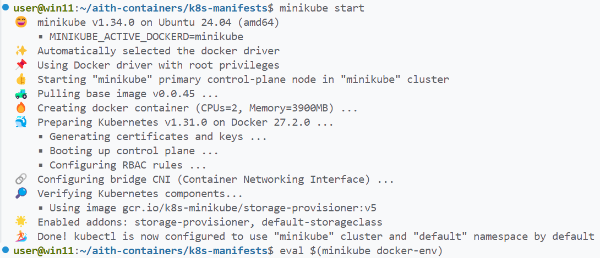
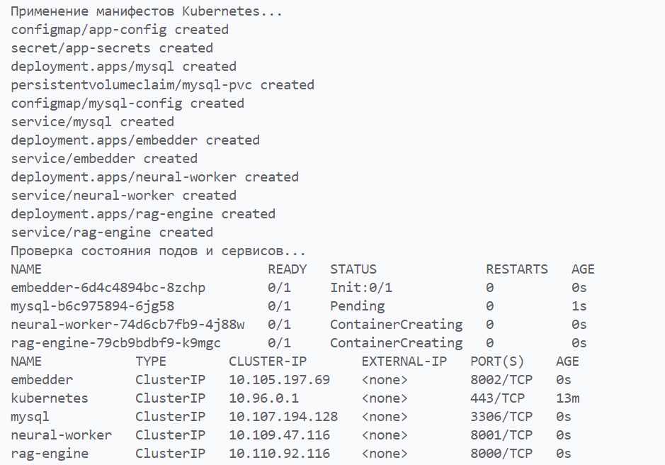
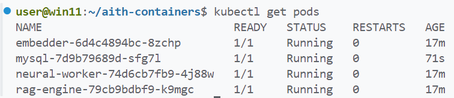
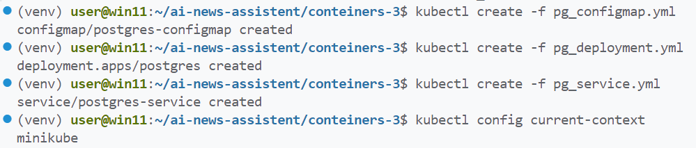
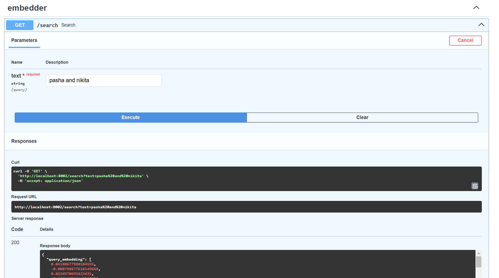

# ЛР 4. More Kubernetes
## Задача
- Развернуть свой собственный сервис в Kubernetes, по аналогии с ЛР 3

Манифесты хранятся в `k8s-manifests`

## Шаги по настройке
1. Указать в `k8s-manifests/secrets.yml` ключи и пароли.

1. Запуск minikube командой minikube start и настройка Docker на использование minikube daemon:

   ```bash
   minikube start
   eval $(minikube docker-env)
   ```
   

2. Запуск deploy.sh для сбора образов в среде миникуба и применения манифестов kubernetes: 

   ```bash
   chmod +x deploy.sh
   ./deploy.sh 
   ```

3. Применение манифестов и проверка логов подов из `deploy.sh`:

   

   


5. Проброс портов наружу:

   ```bash
   kubectl port-forward svc/embedder 8002:8002
   ```
6. Сервис работает:
   
   
