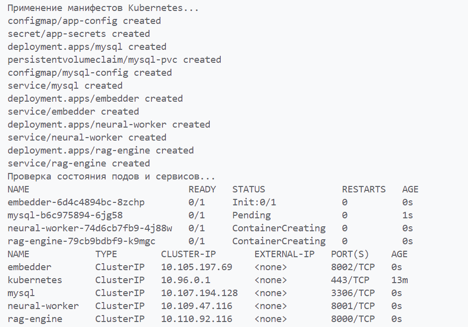

Манифесты хранятся в `k8s-manifests`


## Шаги по настройке


1. Запуск minikube командой minikube start и настройка Docker на использование minikube daemon:

   ```bash
   minikube start
   eval $(minikube docker-env)
   ```
   

2. Запуск deploy.sh для сбора образов в среде миникуба и применения манифестов kubernetes: 

   ```bash
   chmod +x deploy.sh
   ./deploy.sh 
   ```

3. Применение манифестов и проверка логов подов из `deploy.sh`:



4. Проверка состояния подов:

   
   

5. Получение доступа к сервисам:

