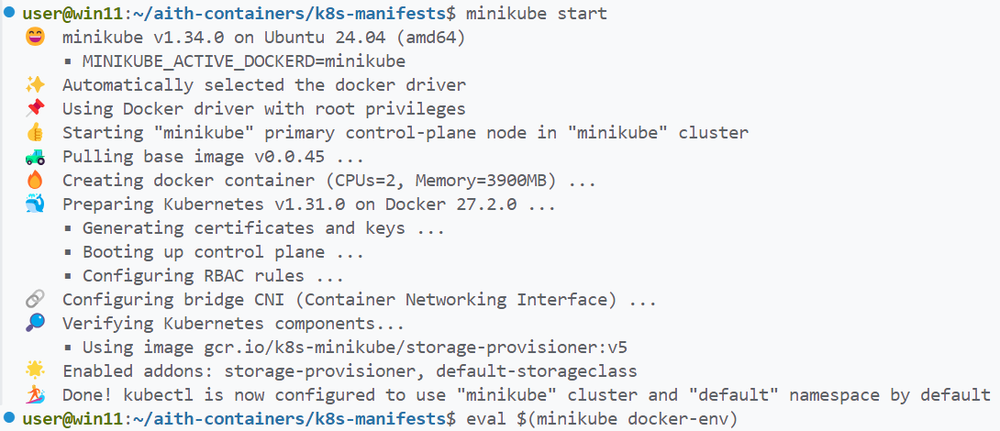
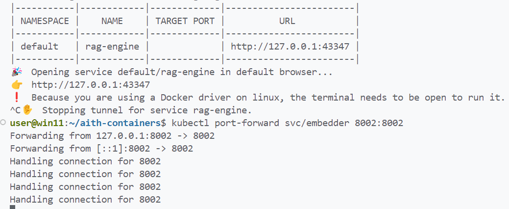
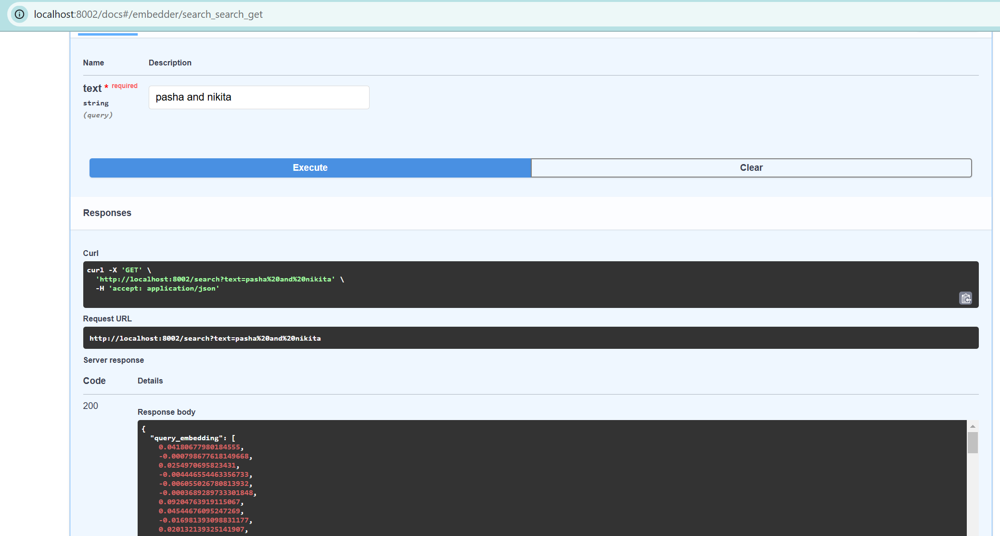

## Лабораторная работа 3: Kubernetes

### Задача

*Установить Kubernetes на локальную машину и развернуть тестовый сервис.*

## Запуск Minikube:

## Проверка, что Minikube работает:

## Прогоняем манифесты используя команду `kubectl apply -f <имя_файла>` для создания объектов.

## Проверяем созданные ресурсы с помощью `kubectl get` и `kubectl describe`.

## Создаем nextcloud.yml, после  запуска пода, проверяем его состояние с помощью `kubectl logs`

## Создание service nextcloud c перенаправлением портов командой `kubectl expose deployment nextcloud --type=NodePort --port=80`
## Туннелирование: `minikube service nextcloud`

## Nextcloud

## Дополнительный компонент dashboard для minikube

## Ответы на вопросы

1. **Важен ли порядок выполнения манифестов?**
   - Да, порядок выполнения манифестов важен, так как одни ресурсы зависят от других. Например, деплоймент PostgreSQL зависит от существования ConfigMap и Secret, следовательно не сможет запуститься, пока они не запущены. Также и сервис создается до деплоймент, чтобы обеспечить доступ к базе данных.

2. **Что произойдет, если отскейлить количество реплик postgres-deployment в 0, затем обратно в 1?**
   - При скейлинге в 0 все поды будут удалены, и соединение с базой данных будет потеряно. Также и Nextcloud потеряет соединение. При возврате в 1 база данных будет перезапущена, и данные сохранятся, если используется постоянное хранилище. Однако, Nextcloud будет видеть БД, но не сможет подключиться к ней. потому что соединение прервалось при отключении базы данных и не восстанавливалось автоматически.
